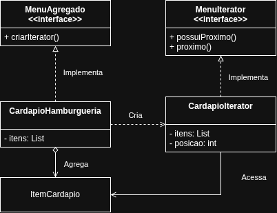

# iterator
Trabalho para entrega "Padrão Iterator" da disciplina de "Arquitetura e Projeto de Software" no curso de "Engenharia de Software". [Repositório temporário]

---
## Referências

[Refactoring Guru](https://refactoring.guru/design-patterns/iterator)
[Repositório do professor](https://github.com/marcoaparaujo/padroes-projeto)

---
## Diagrama

